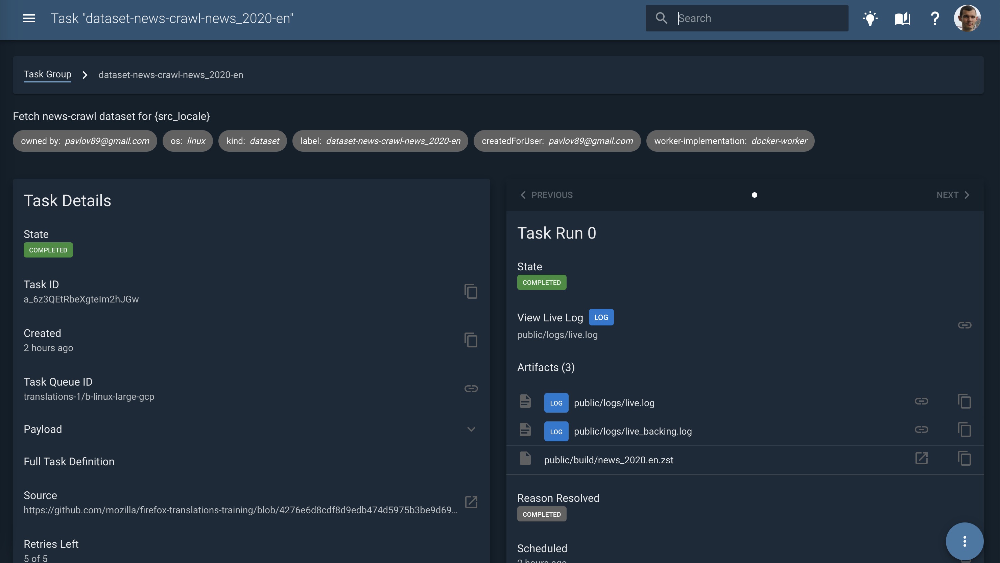
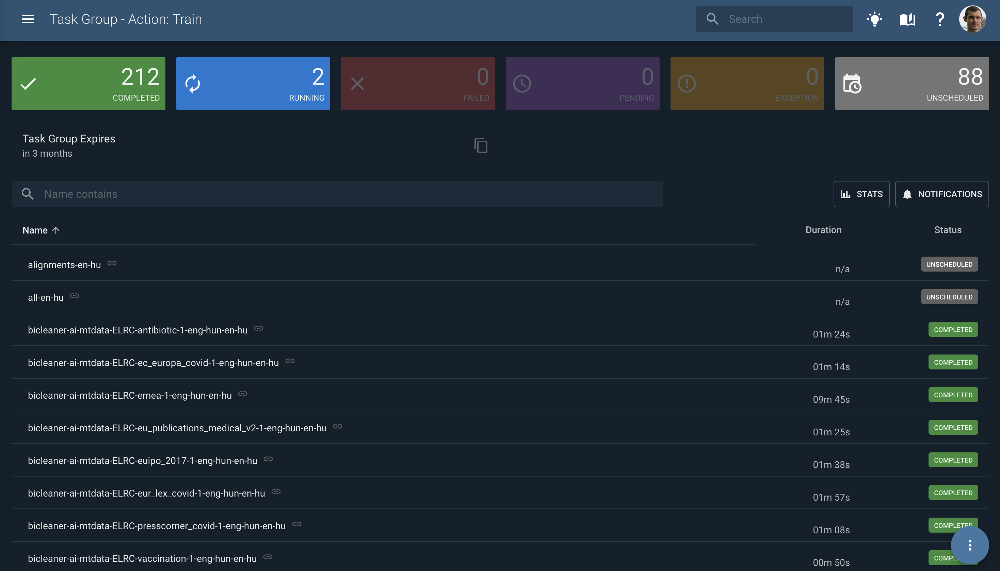
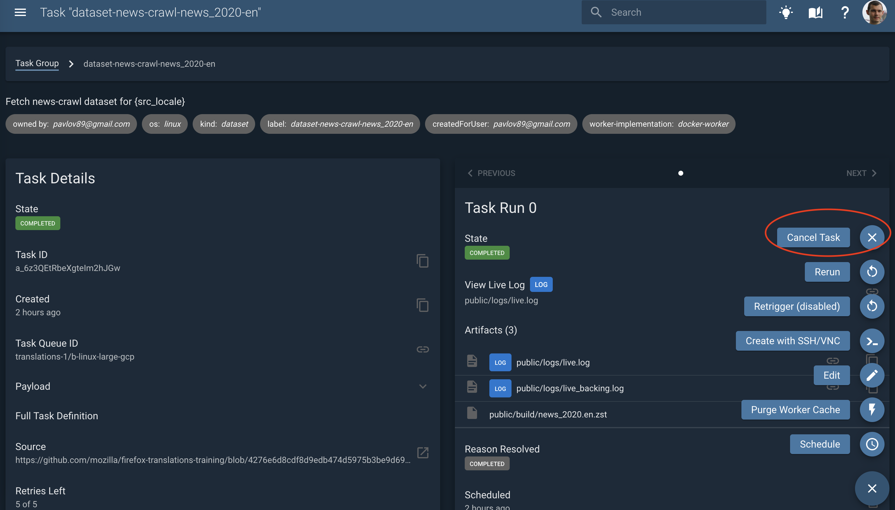

# Taskcluster

[Taskcluster](https://taskcluster.net/) is a Mozilla task execution framework. It powers Firefox CI and
provides access to the hybrid cloud workers (GCP or on-prem)
which increases scalability and observability compared to [Snakemake](snakemake.md).

We use [Taskcluster taskgraph](https://taskcluster-taskgraph.readthedocs.io/en/latest/) to define the DAG
(Directly Acyclic Graph) of the pipeline steps.

## Development

When making changes to Taskcluster parts of the pipeline it is often necessary to run training before opening a pull request with the change. To do this, ensure that you push your change to a branch of `mozilla/translations` that begins with `dev`. (Only pushes to `main`, `dev*`, and `release*` will run Taskcluster tasks.)

## Running training

1. Locally check out an up to date branch from the `mozilla/translations`, such as `release` or `main`, or create a local branch prefixed with `dev` and push it up to `mozilla/translations`.

1. Prepare a config by automatically generating one with the config generator.
   For example: `task config-generator -- en lt --name experiments-2024-H2`
   Compare it against the [production config](https://github.com/mozilla/translations/tree/main/configs/tc.prod.yml) which has inline documentation and refer to the [model training guide](training-guide.md).

1. Run `task train -- --config path/to/config.yml`. For more configuration options on the script add `--help`.

1. If you are not logged in, it will prompt you to run an `eval` script that will export the environment variables for a Taskcluster session.

1. Visually verify the configuration, and confirm the training by entering `y`.

1. It will print a URL to the triggered train action.

## Checking the status of training

1. Look at the scheduled tasks. They should be visible under the Train action.


1. Press any task. Here you can look at the logs and artifacts produced by the task.



3. Navigate to a parent Task Group again (it is a different one than for the Train Action).
   Here you can see all the scheduled tasks in a more convenient interface with filtering.



## Resource monitoring

CPU, GPU, RAM, and other metrics are available in GCP. The [Firefox Translations Worker Monitoring Dashboard](https://console.cloud.google.com/monitoring/dashboards/builder/a6c8749a-75e2-490a-a7ea-628960c70ea8;startTime=2024-01-25T14:43:04Z;endTime=2024-01-25T20:43:04Z?project=fxci-production-level1-workers) is a good starting point for observing resource utilization during training. You should filter this dashboard on the `name` of the instance running your training task. You can find this name at the top of the training log as the first part of the `public-hostname`. Eg:
```
[taskcluster 2024-01-24T18:43:50.869Z]     "public-hostname": "translations-1-b-linux-v100-gpu-4-300g-uwfi5olorq6omun0mr1wgq.c.fxci-production-level1-workers.internal",
```

Once you have the name you can use the "Add filter" button near the top of the page to limit the data shown. You should end up with a dashboard similar to this when done:
.

If you want to customize your own dashboard with different widgets you can create a new Dashboard by clicking the "Firefox Translations Worker Monitoring" followed by "Create Dashboard". (A detailed tutorial on how to create these dashboards is out of scope for this document, but there are many resources available online, and the UI is fairly intuitive.)

## Rerunning

Quite often you need to rerun the pipeline after making fixes or when a task fails.

It is possible to manually cancel a task with the Cancel task action.



After the fixes were implemented, push again and restart the pipeline with the same procedure
as described in the "Running training" section.

### Caching

Some steps might be already cached from the previous run depending on the fixes.
For example if only a config setting that affects the last task was changed,
or if nothing changed at all the pipeline might restart from the failed/cancelled step.

Warning: even a slight refactoring of the upstream steps can invalidate caches for the whole pipeline completely,
so it's better to be careful with that when experimenting with the later stages of the pipeleine.


## Running up to a specific step

Change `target-stage: all` in the training config to a stage that corresponds to another TC step.
For example, to download, clean and merge the training corpus use:
```
target-stage: merge-corpus
```
that corresponds to `stage: merge-corpus` in [/taskcluster/ci/merge-corpus/kind.yml](https://github.com/mozilla/translations/taskcluster/ci/merge-corpus/kind.yml):
```
tasks:
    merge-corpus:
        label: merge-corpus-{src_locale}-{trg_locale}
        description: merge corpus for {src_locale}-{trg_locale}
        attributes:
            dataset-category: train
            stage: merge-corpus
```

## Running only later parts of the pipeline

When hacking on later parts of the pipeline it can often be useful to re-use earlier runs of the pipeline, even if those runs were done with different training parameters. To do this, we must bypass the usual caching mechanisms of Taskgraph, and force it to replace earlier tasks with ones we provide. To do this, you can run a training action as usual, but also provide `start-stage` and `previous_group_ids` parameters. For example:

```
start-stage: train-student
target-stage: all
previous_group_ids: ["SsGpi3TGShaDT-h93fHL-g"]
```

...will run `train-student` and all tasks _after_ it. All tasks upstream of `train-student` will be replaced with the tasks of the same name from the `SsGpi3TGShaDT-h93fHL-g` task group, or tasks that are upstream from one of those tasks. It is important that you provide a task group id that contains the task or tasks from the `start-stage` you've given, otherwise Taskgraph will be unable to correctly find the upstream tasks you want to re-use.

Note: This feature should _never_ be used for production training, as it completely bypasses all caching mechanisms, and you will most likely end up with invalid or useless models.

## Dealing with expired upstream tasks

All tasks eventually expire, and have their artifacts and metadata deleted from Taskcluster, typically 1 year after creation. This can cause problems if it happens while partway through a training session. This happens most commonly with tasks that are shared across multiple training runs, such as `toolchain` and `docker-image` tasks. When this happens you can use the "Rebuild Docker Images and Toolchains" action to rebuild these, and add the task group they are rebuilt in to the `previous_group_ids` when kicking off a training run.

You may also use this action directly prior to kicking off the start of a new language pair training to ensure that it uses fresh toolchains and docker images, which will typically avoid this problem altogether.

## Interactive Tasks

Taskcluster allows authorized users to run so-called [interactive tasks](https://docs.taskcluster.net/docs/reference/workers/docker-worker/features#feature-interactive). These tasks allow users to gain a shell in the same environment that a pipeline step runs in. This can often be useful for quicker debugging or testing of ideas.

To start an interactive task, follow these steps:

1. Go to the task you want an interactive version of, eg: https://firefox-ci-tc.services.mozilla.com/tasks/DZvVQ-VUTPSyPBBS13Bwfg

2. Click the "Edit" button in the three dots menu

3. Click "Edit" on the modal that pops up

4. Click the "Interactive" toggle in the top left

5. Reduce the maxRunTime to a best guess at how long you'll need the task and worker running for. (We pay for every minute a worker runs - so they should not be kept running, eg: overnight.)

6. Adjust the payload to simply run bash and sleep (instead of a full pipeline step). For docker-worker tasks use something like:
```
     command:
    - bash
    - '-c'
    - 'sleep 7200'
```

For generic-worker tasks (those needing a GPU), use:
```
     command:
    - - bash
      - '-c'
      - 'sleep 7200'
```

(docker-worker tasks have an `image` section in the payload)

7. Click "Create Task"

After a few minutes you should be able to get a shell (a link will show up in the tab when it's ready).
